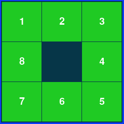
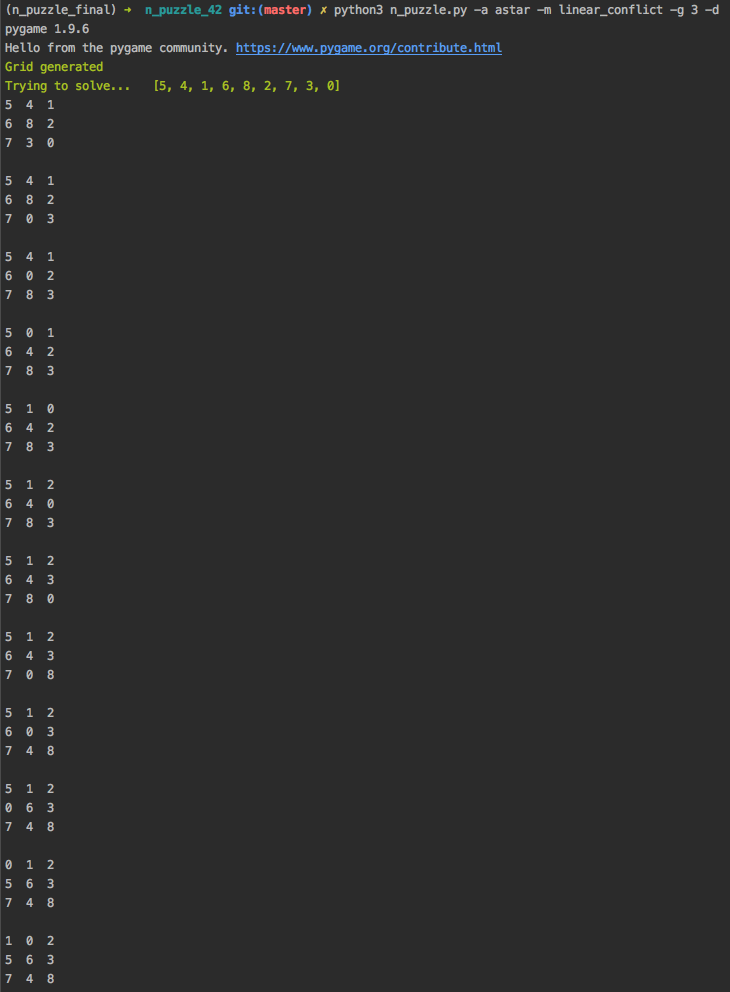

# N-puzzle

N-puzzle is a project as part of the 42 algorithmic curriculum.
The aim of the project is to build an algorithm which solves whichever npuzzle is given as input (The most common
npuzzles are 8-puzzle of size 3 x 3 and 15-puzzle of size 4 x 4).
The npuzzle has to be solvable otherwise the program will tell the user the npuzzle provided cannot be solved.

The npuzzle game consists of a matrix with 8 filled tiles and 1 blank area.
A few or all the filled tiles can be misplaced.
The goal is to obtain the final sorted npuzzle by swapping a tile with the blank area.

Unlike the most common version of the n-puzzle game, the aimed puzzle of this project forms a snail around the center,
as represented below:

starting 8-puzzle           |   goal 8-puzzle       
:--------------------------:|:------------------------------:|
 | 

### Usage
***

```
python3 n_puzzle.py [-h] [-d] [-a astar|ida_star|uniform|greedy] [-m manhattan|linear_conflict|misplaced_tiles] [-g n] -f puzzle_file [-v]
```

Arguments :

Short flag       | Long flag              | Description
:----------------|:-----------------------| :---------------------------|
  -h             | --help                 |    Show help message
  -d             | --detail               |     Outputs detailed path chosen by the algorithm
  -f FILENAME    | --filename FILENAME    |     Gives a text file containing a puzzle to solve
  -g INT         | --generator INT        |    Generates a solvable puzzle of size {int} 
  -m METHOD      | --method METHOD        |    Method to be used for heuristic calculation. Default is `misplaced_tiles`
  -a ALGO        | --algo ALGO            |    Algorithm used to solve the n-puzzle. Default is `uniformed_cost`
  -v             | --visu                 |    Show the results as a GUI

### Example
***

