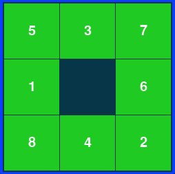

# N-puzzle

N-puzzle is a project as part of the 42 algorithmic curriculum.
The aim of the project is to build an algorithm which solves whichever npuzzle is given as input (The most common
npuzzles are 8-puzzle of size 3 x 3 and 15-puzzle of size 4 x 4).
The npuzzle has to be solvable otherwise the program will tell the user the npuzzle provided cannot be solved.

The npuzzle game consists of a matrix with 8 filled tiles and 1 blank area.
A few or all the filled tiles can be misplaced.
The goal is to obtain the final sorted npuzzle by swapping a tile with the blank area.

starting 8-puzzle           |   goal 8-puzzle       
:--------------------------:|:------------------------------:|
 | 